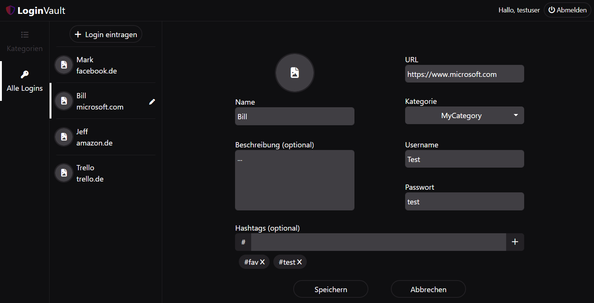
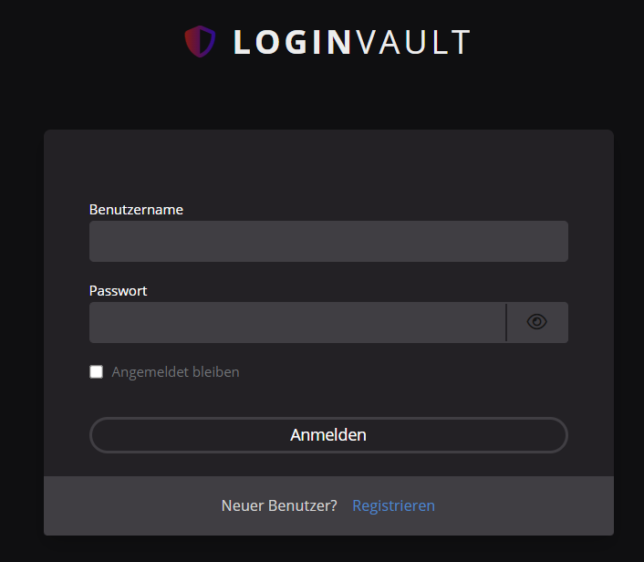

# Code Examples

This repository collects some code examples from different personal projects.
In most cases, the given sources are not complete i.e. they cannot be
compiled/executed/... as is. Nevertheless, they provide an insight to some
of the projects more interesting areas.

## LoginVault
Goal for this project was to implement a password manager.
Each login can be grouped into a category, while both entities provide
the default CRUD operations.

The excerpt contains examples from the backend (login entity, S3 image handling),
frontend (login form, API-services, entity-list) and an overview of Keycloak and Kubernetes
configuration.

**Backend**: Java, Spring Boot, Hibernate/JPA, Lombok, AssertJ/Mockito  
**Frontend**: Angular, TypeScript, HTML, (S)CSS, Bootstrap  
**Misc**: Keycloak, AWS S3, Docker, Kubernetes

