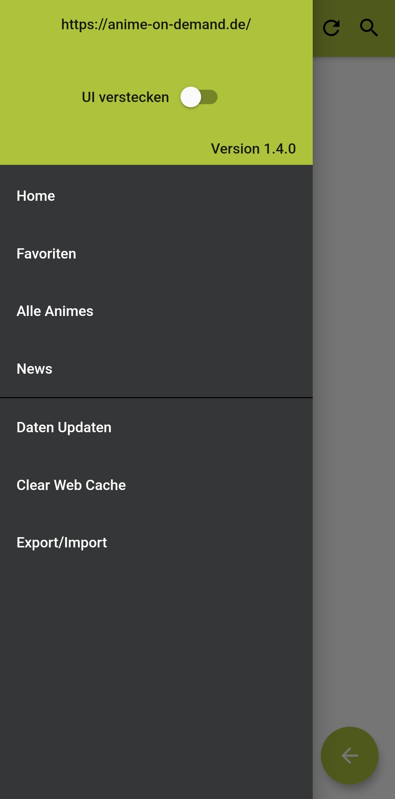
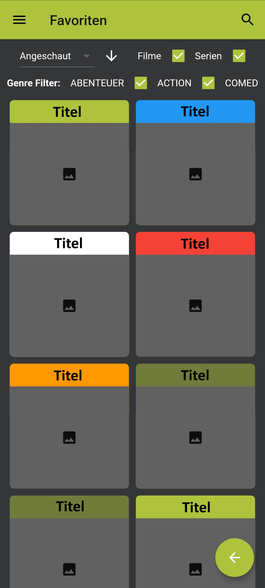

# Code Examples

This repository collects some code examples from different personal projects.
The given sources may not be complete i.e. they cannot be
compiled/executed/... as is. Nevertheless, they provide an insight to some
of the projects more interesting areas.

## LoginVault (2023)
Goal for this project was to implement a password manager.
Each login can be grouped into a category, while both entities provide
the default CRUD operations.

The excerpt contains examples from the backend (login entity, S3 image handling),
frontend (login form, API-services, entity-list) and an overview of Keycloak and Kubernetes
configuration.

**Backend**: Java, Spring Boot, Hibernate/JPA, Lombok, AssertJ/Mockito  
**Frontend**: Angular, TypeScript, HTML, (S)CSS, Bootstrap  
**Misc**: Keycloak, AWS S3, Docker, Kubernetes

## AoD Favorites List (2020)
Here, a simple Watchlist was implemented for the (now defunct) Anime streaming service AnimeOnDemand,
as part of an Android app. Each entry could be manually marked with a colour. General filters (movie/show, genre)
and sorting possibilities (watched, added-on, ...) were provided as well. The list was persisted locally.  
To display additional information or using features already provided by the service, an In-App-Browser was used.

**Frontend**: Flutter, Dart, SQL (Moor), Android
**Misc**: DOM crawling

